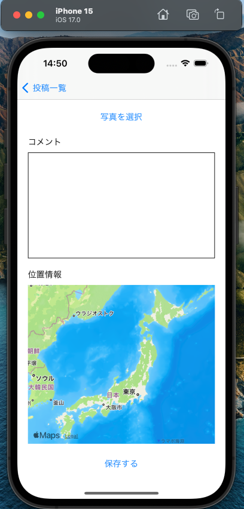
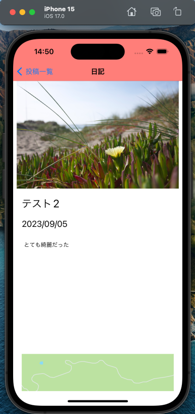

# アイシャ

出かけ先で撮った愛車の写真がカメラロールに埋もれ、いつどこで撮った写真なのか、その時どう感じたのかわからなくなることはありませんか？

そんなあなたに、愛車の写真を記録できる舎(日記)アプリを作成しました！

## デプロイに向けて

現在、app store に公開されておりません。

## 画面遷移イメージ

⚫︎ 一覧画面

⚫︎ 新規投稿画面

⚫︎ 詳細画面

⚫︎ 削除機能

## 機能作成優先順位

- [○] 1. 一覧画面が表示される
- [○] 2. 新規で投稿できる(タイトル、日付、コメント、写真、位置情報)
- [○] 3. 投稿一覧から 1 つの投稿の詳細を確認できる
- [○] 4. 投稿を削除できる
- [ ] 5. 投稿を編集できる
- [ ] 6. 位置情報をキーワードでピン留めできる
- [ ] 7. 写真をタップすると画面いっぱいに拡大する
